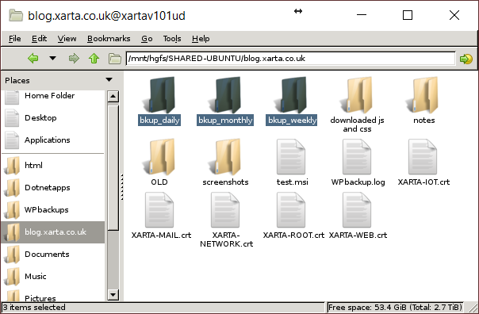
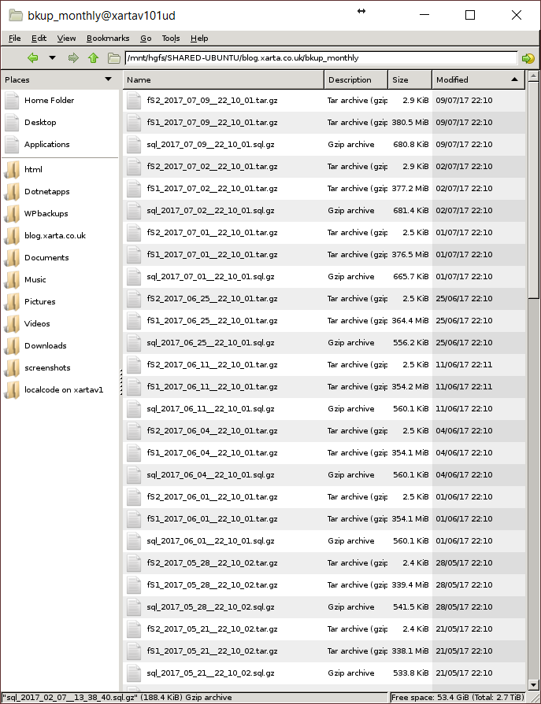
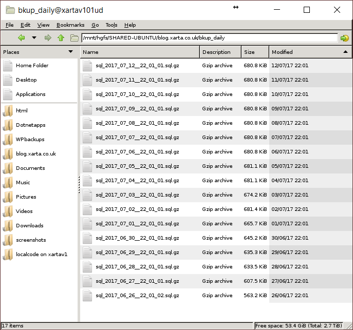

# Intent

My WordPress websites run on both IIS, Windows 10, and Apache, Ubuntu.

PRTG provides a mini-probe for Linux in Python - fairly limited.  What I'd like to do though, is have a common .Net Core "sensor" that can, in this case, check for my own WordPress back-up script back-up files on a daily basis.  Moving forward, in the future, I want to try and do as much as possible in a RESTful way, isolating vlans as much as possible.

This particular "sensor" / WebAPI will provide JSON, initially with a minimum entry of the filesize found for a named file (0 if error etc.) No authentication is required or anything fancy.  It will be internal use only, still over SSL of course, but on a different, free port (haven't chosen yet).

PRTG already provide "advanced" http sensors that can check JSON in a response for a value ... but in the future I could make my own custom http sensor to parse JSON, and depending on parameters passed to that sensor, provide in it's response only a selected channel of data.

That's the plan anyway.

About time I got back into .Net and learn how to do WebAPI in .Net Core, and, in linux.
I'll be learning as I go along - with nearly everything I do, as I go along, probably turning-out to be a mistake.

***
#### Information to capture

For my blog, running in an Ubuntu VM, I actually share a host-Windows folder using VMware, and mount that within Ubuntu as a destination for the scripted back-ups.

https://github.com/xarta/wp-backup-bash

I *think* I made a "mistake" with the monthly cron job - as I seem to be saving weeklies in there?  I get confused.  No harm-done anyway.  The daily and weekly folders seem to be working just fine.

First of all, I need to decide what information I want to gather and how I want to present it as JSON.