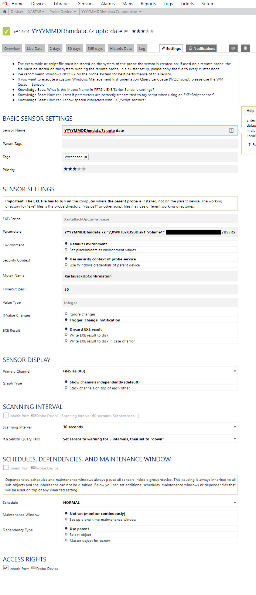

# PRTG
My PRTG custom sensors

PRTG:  *see* https://www.paessler.com/

## Purpose

I use PRTG in my home-network.  My email back-up scripts, for example:
https://github.com/xarta/hmailserver-backup-scripts
... create 3 daily back-up files with dates in the different file-names.

description             | e.g. file                        | e.g. filesize
------------------------|----------------------------------|--------------
settings | 20170711-0500HMsettings.7z | 127 KB
MySQL dump | 20170711hmdump.sql.7z | 10,858 KB
7z of eml files etc. | 20170711hmdata.7z | 981,900 KB

A custom sensor here checks later in the day that the files exist. 
The sensor reports the filesizes so I can graph them in PRTG.
Also, PRTG can be set to report changes above set % thresholds.

If the new back-up files don't exist, then an alarm sounds at home on
a dedicated Android tablet running a PRTG monitor (original Nexus 7).
And my phone, monitoring PRTG via https://x.xarta.co.uk which exposes 
PRTG via my active-reverse-proxy will also update me. Push notifications
triggering the phone app and in general where approved, alert me via my
Pebble watch.

***

## Reference Information

I've compiled/interpreted information here so as to be handy:
 
https://kb.paessler.com/en/topic/74481-can-the-customer-sensor-exe-be-a-ui-application
https://kb.paessler.com/en/topic/15813-custom-parameters-in-custom-sensors
https://www.paessler.com/manuals/prtg/exe_script_advanced_sensor
 
Detailed information available using PRTG (installation) web interface/portal.
 
My first sensor is a STANDARD SENSOR.  NOT an "advanced sensor".
https://www.paessler.com/manuals/prtg/exe_script_advanced_sensor
 
 
 
#### COMMAND LINE:
*How to test sensor* 

sensor.exe parameter > result.txt
 
 
 
#### PARAMETER:

 
In the "parameter" field you can use the following placeholders

Placeholder       |      Description
------------------|-----------------
%sensorid | The ID of the EXE/Script sensor
%deviceid | The ID of the device the sensor is created in
%groupid | The ID of the group the sensor is created in
%probeid | The ID of the probe the sensor is created on
%host | The IP address/DNS name entry of the device the sensor is created on
%device | The name of the device the sensor is created on
%group | The name of the group the sensor is created in
%probe | The name of the probe the sensor is created on
%name or %sensor | The name of the EXE/Script sensor
.| **May be inherited by parent:**
%windowsdomain | The domain for Windows access
%windowsuser | The user name for Windows access
%windowspassword | The password for Windows access
%linuxuser | The user name for Linux access
%linuxpassword | The password for Linux access
%snmpcommunity | The community string for SNMP v1 or v2

 
"Please make sure you write the placeholders in quotes to ensure that they are 
 working properly if their values contain blanks. Use single quotation marks ' ' 
with PowerShell scripts, and double quotes \" \" with all others."

#### Return Value (standard out)
 
 * Int64 value; &nbsp;&nbsp;&nbsp;&nbsp;&nbsp;&nbsp;&nbsp;&nbsp;// Value has to be a 64-bit integer or float. (Int64 == Long)
 * string message; &nbsp;// max. 2000 characters (visible at top of Overview screen in PRTG for sensor)

"value" might represent bytes, milliseconds etc. and is stored in the PRTG database.
"message" can be any string.
 
#### EXIT code of the EXE  *has to be one of the following values:*

Value  |  Description
-------|-------------
0 | OK
1 | WARNING
2 | System Error (e.g. a network/socket error)
3 | Protocol Error (e.g. web server returns a 404)
4 | Content Error (e.g. a web page does not contain a required word)

 
 

 
